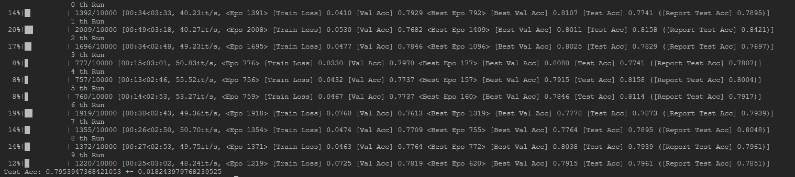

# Commute Graph Neural Networks

## Installation

```
pip install -r requirements.txt
```

## Datasets

The five data sets used in this paper can be automatically downloaded through pytorch_geometric.

## How to Run
- Running command:
```
python main.py --dataset [dataset] \
--model [CGNN]
```
1. Experiment Dataset (the dataset will be downloaded automatically at the first running time):\
       Set [dataset] as one of ['chameleon', 'squirrel', 'cora_ml', 'citeseer', 'photo']
2. Set the [model] as 'CGNN' 

## Running Example on Chameleon

